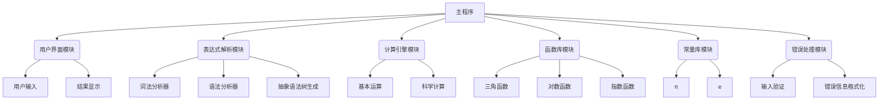

# 命令行科学计算器架构设计

## 1. 系统概述

本项目旨在开发一个基于命令行的科学计算器，支持基本算术运算、科学函数计算、表达式解析等功能。系统采用模块化设计，便于维护和扩展。

## 2. 核心功能需求

- 基本算术运算：加、减、乘、除、幂运算
- 科学函数：三角函数（sin, cos, tan）、对数函数、指数函数、开方等
- 表达式解析：支持括号、运算符优先级
- 常量支持：π、e等数学常量
- 错误处理：输入错误、运算错误提示
- 用户界面：命令行交互界面

## 3. 系统架构图



## 4. 模块设计

### 4.1 主程序模块 (main.cpp)
- 初始化各子模块
- 控制程序流程
- 协调各模块间的数据传递

### 4.2 用户界面模块 (ui.h/ui.cpp)
- 显示欢迎信息和帮助说明
- 接收用户输入
- 显示计算结果或错误信息
- 处理退出命令

### 4.3 表达式解析模块 (parser.h/parser.cpp)
- 词法分析：将输入字符串分解为标记(token)
- 语法分析：根据运算符优先级构建表达式树
- 抽象语法树(AST)生成：用于后续计算

### 4.4 计算引擎模块 (calculator.h/calculator.cpp)
- 遍历抽象语法树执行计算
- 调用函数库进行科学计算
- 处理基本算术运算

### 4.5 函数库模块 (functions.h/functions.cpp)
- 实现各种科学计算函数
- 包括三角函数、对数函数、指数函数等
- 提供函数名到函数指针的映射

### 4.6 常量库模块 (constants.h/constants.cpp)
- 定义常用数学常量如π、e等
- 提供常量名到数值的映射

### 4.7 错误处理模块 (error.h/error.cpp)
- 定义错误类型枚举
- 实现错误信息格式化
- 提供统一的错误报告机制

## 5. 数据结构与接口规范

### 5.1 Token结构
```cpp
enum TokenType {
    NUMBER,
    OPERATOR,
    FUNCTION,
    CONSTANT,
    LPAREN,
    RPAREN,
    END
};

struct Token {
    TokenType type;
    double value;      // 当type为NUMBER时使用
    std::string name;  // 当type为FUNCTION或CONSTANT时使用
    char op;           // 当type为OPERATOR时使用
};
```

### 5.2 AST节点结构
```cpp
enum NodeType {
    NUM_NODE,
    BIN_OP_NODE,
    UNARY_OP_NODE,
    FUNC_CALL_NODE
};

struct ASTNode {
    NodeType type;
    double value;              // 当type为NUM_NODE时使用
    char op;                   // 当type为BIN_OP_NODE或UNARY_OP_NODE时使用
    std::string funcName;      // 当type为FUNC_CALL_NODE时使用
    std::shared_ptr<ASTNode> left;   // 左子树
    std::shared_ptr<ASTNode> right;  // 右子树
    std::shared_ptr<ASTNode> operand; // 操作数（用于一元运算）
    std::vector<std::shared_ptr<ASTNode>> args; // 函数参数列表
};
```

### 5.3 主要接口定义

#### Parser类接口
```cpp
class Parser {
public:
    Parser(const std::string& expression);
    std::shared_ptr<ASTNode> parse();
private:
    std::vector<Token> tokenize();
    std::shared_ptr<ASTNode> parseExpression();
    std::shared_ptr<ASTNode> parseTerm();
    std::shared_ptr<ASTNode> parseFactor();
    Token getNextToken();
    void consumeToken();
};
```

#### Calculator类接口
```cpp
class Calculator {
public:
    double evaluate(std::shared_ptr<ASTNode> node);
private:
    double applyFunction(const std::string& funcName, const std::vector<double>& args);
    double applyOperator(char op, double left, double right);
};
```

## 6. 模块交互关系

1. 主程序初始化所有模块并控制整体流程
2. 用户界面模块接收用户输入并传递给表达式解析模块
3. 表达式解析模块将解析后的AST传递给计算引擎模块
4. 计算引擎在需要时调用函数库和常量库
5. 所有模块通过错误处理模块报告错误
6. 计算结果由用户界面模块显示给用户

## 7. 编译与运行

使用CMake构建项目：
```bash
mkdir build
cd build
cmake ..
make
./scientific_calculator
```

## 8. 扩展性考虑

- 新增函数：只需在函数库中添加实现，并更新函数名映射表
- 新增常量：在常量库中添加新的常量定义
- 新运算符：修改表达式解析模块以识别新运算符，并在计算引擎中实现其逻辑
